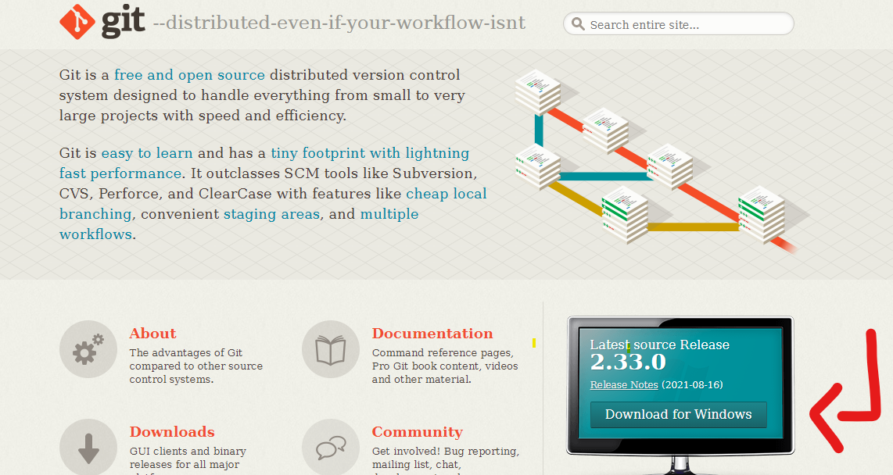
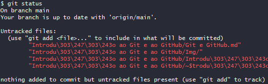
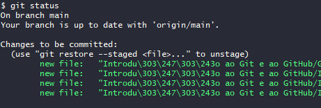
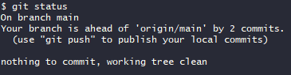

<h1 align="center"> Introdução ao Git e ao GitHub </h1>

<h2 align="justify"> Descrição do projeto 💻 </h2>

 Desenvolver um guia colaborativo do Git/GitHub com linguagem de fácil entendimento e didático, que possa ser usado por qualquer pessoa. Além de servir como caderno de anotações, será também um local para registros de problemas comuns, possíveis cenários, assim como a sua solução. Sinta-se a vontade para contribuir com esse projeto!

 

 

#### Meu Linkdln:
#### https://www.linkedin.com/in/kevin-figueira-0343a0207/

 

#### Meu GitHub:
#### https://github.com/kevinfigueira

 

## Status do Projeto: Em desenvolvimento ⚠

 

## O que é o Git? </img>

 

 Git é um sistema de controle de versão distribuído gratuito e de código aberto projetado para lidar com tudo, desde projetos pequenos a muito grandes com velocidade e eficiência.

Git é fácil de aprender e tem uma pegada pequena com desempenho extremamente rápido. Ele supera as ferramentas SCM como Subversion, CVS, Perforce e ClearCase com recursos como ramificação local barata, áreas de teste convenientes e vários fluxos de trabalho. 

Em outras palavras, Git é essencial para projetos realizados em equipe, tornando possível o desenvolvimento do projeto de forma colaborativa, onde a equipe poderá desenvolver no mesmo código, evitando conflitos entre as alterações realizadas.

 

## Como instalar o Git?

 

#### Versão para Linux/Unix:

 

[Clique aqui.](https://git-scm.com/download/linux)

 

#### Versão para macOS:

 

[Clique aqui.](https://git-scm.com/download/mac)

 

#### Versão para Windows:

 

#### 1º - [Acesse o link da página oficial do Git, clicando aqui.](https://git-scm.com/)

 

#### 2º - Clique em Download for Windows para baixar o instalador do git.

 

</img>

 

#### 3º - Depois de baixado, basta clicar duas vezes sobre o instalador do Git para Windows, seguir as instruções na tela, clicando em **Next** e no final em **Finish** para terminar a instalação.

 

#### 4º - Se tudo ocorreu com sucesso, poderemos verificar a versão do Git instalada usando o seguinte comando no cmd do Windows:

 

1. #### Abra o menu iniciar e digite cmd e clique em **Prompt de Comando**;

 

2. #### No Prompt de Comando, digite o seguinte comando:
   
    
   
   `git --version`

    

   #### O resultado será como esse:
        C:\Users\namepc>git --version
        git version 2.33.0.windows.2
    #### Onde estar mostrando que a versão instalada é a 2.33.0.windows.2

     
 
#### 5º - Crie uma conta no GitHub, [clique aqui.](https://github.com/)

 

#### 6º - Supondo que você já tenha uma conta no GitHub, iremos criar uma chave SSH e um Token para os seus futuro repositórios.

 

## Chave SSH 🔑

 

 Se você confia na máquina em que estar usando, onde a mesma não é pública, poderemos autenticar ela. Com isso, ao fazermos o uso do Git/GitHub com a máquina confiável, não será preciso passar por alguns fatores de autenticação.

 

1. #### Inicie o **Git Bash**. Basta abrir o menu iniciar e digitar Git e depois clicar em **Git Bash**.
   
    

2. #### Execute o seguinte comando para gerar a chave SSH:
   
    
   
   `ssh-keygen -t ed25519 -C Seu_E-mail_usado_no_GitHub`
   
    

3. #### Após, navegue até o diretório onde as chaves foram salvas usando o comando **cd**. Por padrão as chaves são salvas na Pasta_do_Usuário/.ssh. Lembre-se de trocar no comando abaixo o "Nome_do_Usuário", sem as aspas, pelo o seu nome de usuário.
   
    
   
   `cd /c/Users/Nome_do_Usuário/.ssh`
   
    

4. #### Poderemos usar o comando **ls** para listar os conteúdos do diretório:
   
    
   
   `ls`
   
    

5. #### Visualize o conteúdo da chave SSH **pública** utilizando o comando **cat** e a copie para adicionar no GitHub/SSH and GPG Keys. A chave **pública** tem a extensão **.pub**. Substitua "id_sua_chave_SSH.pub", sem as aspas, pela a sua:
   
    

   `cat id_sua_chave_SSH.pub`
   
    

6. #### Agora precisamos iniciar o SSH Agent:
   
    

   `eval $(ssh-agent -s)`

    

7. #### Passar a chave **privada** para o SSH Agent. Troque "Id_chave", sem as aspas, pela a sua:
   
    
   
   `ssh-add Id_chave`
   
    

8.  #### Após, iremos ao GitHub para adicionar a chave SSH.
   
    

   1. #### Clique no seu ícone de perfil, depois em Settings;
   
    
   
   2. #### No canto esquerdo, procure por **SSH and GPG keys**;
   
    
   
   3. #### Em SSH keys, clique em **New SSH key**;
   
    
   
   4. #### Adicione um título que tenha algum significado, como por exemplo: "Minha máquina linux";
   
    
   
   5. #### Cole o conteúdo da chave SSH **PÚBLICA**;
   
    
   
   6. #### Depois de colado, clique em **Add SSH key**.
   
    

## Token de acesso pessoal 🔑

 

 Com o token, não precisaremos colocar usuário e senha, sempre quando for preciso autenticar. Ele é mais uma forma prática para permitir alterações no GitHub.

 

1. #### Abra seu GitHub, clique na foto do seu perfil, depos em Settings.
   
    

2. #### No canto esquerdo, procure por **Developer settings** e clique nela. Depois, no canto esquerdo, clique em **Personal access tokens**
   
    

3. #### Clique em **Generate new token**. Depois, escreva uma descrição em **Note**, como por exemplo, respondendo a pergunta, qual a finalidade desse token? Iremos criar um token para os nossos repositórios, ele será como uma senha, que poderá ser usada para autenticar a alteração ao seu repositório.
   
    

4. #### Selecione a validade desse token;
   
    

5. #### Em **Select scopes**, marque a caixinha **repo**. Role a página lá para baixo e clique no botão verde **Generate Token**.
   
    

6. #### **Copie a chave token para um lugar seguro, pois você não poderá visualizar ela novamente. Se caso perder, terá que gerar uma nova chave token**
   
    

## Primeiros comandos com o Git </img>

 

1. #### Crie um diretório (Pasta) a sua escolha para que possamos iniciar o Git nele.
   
    

2. #### Com a pasta criada, inicie o Git Bash nesse diretório, poderá estar clicando com o botão direito do mouse e selecionando **Git Bash Here**.
   
    

3. #### Com o Git Bash no diretório, execute o comando abaixo para iniciar o Git nesse diretório:
   
    

   `git init`
   
    

4. #### Agora precisaremos adicionar nossas informações cadastradas no GitHub:
   
    

   `git config --global user.email "Seu e-mail"`
   
    

   `git config --global user.name digite-seu-nome`
   
    

5. #### Agora iremos mover o diretório em questão para a Staging Area:
   `git add *`

    

6. #### Depois, iremos mover para o repositório local, em outras palavras iremos commitar o repositório:
   `git commit -m "Escreva uma msg que faça sentido ao seu commit"`
   
    
   
   #### Exemplo:
   
     
   
   `git commit -m "Commit inicial"`

    

#### Podemos verificar o status do diretório usando o seguinte comando:

 

`git status`

 

#### Com isso, poderemos ver se existem modificações que precisam ser movidas para a Staging Area, se existir, o resultado do comando `git status` será parecido como a imagem abaixo:

 

</img>

 

#### Como existem arquivos que podem ser movidos para a Staging Area, basta usar o seguinte comando para mover:

 

`git add *`

 

#### Ou o comando abaixo, para apontar para o arquivo em questão:

 

`git add nome_do_arquivo`

 

#### Agora use o comando `git status` novamente para verificar se existem mudanças para serem commitadas, como na imagem abaixo:

 

 

#### Se existem, iremos commitar, usando o comando abaixo: 

 

`git commit -m "digite_sua_msg..."`

 

#### Os arquivos commitados (repositório local), poderão ser "empurrados" para o repositório remoto (GitHub).

 

## O que é o GitHub? </img>

 

GitHub é uma plataforma de hospedagem de código-fonte e arquivos com controle de versão usando o Git. Ele permite que programadores, utilitários ou qualquer usuário cadastrado na plataforma contribuam em projetos privados e/ou Open Source de qualquer lugar do mundo.
 

[Wikipédia](https://pt.wikipedia.org/wiki/GitHub)

 

## Adicionando o repositório local para o repositório remoto (GitHub)

 

1. #### Crie um repositório no GitHub, clicando na foto do seu perfil e depois em **Your repositories** e depois em **New**;
   
    

2. #### Escreva um nome para o repositório e uma descrição (opcional);
   
    

3. #### Defina como Público ou Privado;
   
    

4. #### Caso você não tenha um arquivo README.md no seu repositório local, você pode adicionar um README.md a partir do GitHub marcando a caixinha, Add a README file;
   
    

5. #### Clique em **Create repository**.
   
    

6. #### Com o repositório criado, precisaremos copiar o endereço do repositório. Para isso, basta abrir o repositório criado, clicar em **Code** e copiar o endereço em HTTPS. Como exemplo, o endereço desse repositório:
   
   #### https://github.com/Marcelo-A-L/Dio-desafio-github-primeiro-repositorio.git
   
    

7. #### Agora com o Git Bash aberto no seu repositório local, execute o seguinte comando para cadastrar o repositório remoto. Substitua "endereço_do_repositório.git", sem as aspas, pelo o endereço do seu repositório criado no GitHub:
   
    
   
   `git remote add origin endereço_do_repositório.git`
   
    

8. #### Certifique-se que não há nenhuma pendência usando o comando `git status` como na imagem abaixo:
   
    
   
   </img>
   
    

9.  #### Vamos "empurrar" o repositório local para o repositório remoto (GitHub):
    
     

    #### **Observação**: Atente-se para a **branch** usada no comando abaixo. Nesse caso, a branch é a **main**, a sua pode ser diferente, se for, troque a branch **main** pela a sua branch.

        `Desafio-Projeto-Git-GitHub/Dio-desafio-github-primeiro-repositorio (main)`
    
     

    #### Execute o comando abaixo para empurrar/upload o seu repositório local para o repositório remoto (GitHub):
    
     

    `git push origin main`

     

#### Agora o seu repositório local estará no repositório que você criou no GitHub.
> Criando assim, o primeiro (de muitos) projetos do seu portfólio 😉

 

#### Sempre que você fizer alguma modificação e sentir necessidade de empurrar para o GitHub, basta mandar os arquivos modificados para a Staging Area:

 

`git add *`

 

#### Commitar:

 

`git commit -m "msg..."`

 

#### E da um Push, atentando-se para a sua branch. Substitua "sua_branch", sem as aspas, **pela a sua**. No meu caso, a minha é a main.

 

`git push origin sua_branch`

 

#### Ficando assim:

 

`git push origin main`

 

###############################################################

 

## Objetos internos do Git

 

### Objetos do Git

> O Git é um sistema de arquivos de conteúdo endereçável. Ótimo. O que isso significa? Isso significa que o coração do Git é um simples armazenamento chave-valor. Você pode inserir qualquer tipo de conteúdo nele, e ele lhe dará de volta uma chave que você pode usar para recuperar o conteúdo de volta em qualquer momento. Para demonstrar isso, você pode usar o comando de encanamento hash-object, que recebe alguns dados, armazena eles em seu diretório .git, e lhe devolve de volta a chave com o qual os dados são armazenados. Primeiramente, inicialize um novo repositório Git e verifique que não há nada no diretório objects:

`$ git init test`  
`Initialized empty Git repository in /tmp/test/.git/` 
`$ cd test` 
`$ find .git/objects` 
`.git/objects` 
`.git/objects/info` 
`.git/objects/pack` 
`$ find .git/objects -type f` 

> O Git inicializou o diretório `objects` diretamente e criou os subdiretórios `pack` e `info` dentro dele, mas não há nenhum arquivo regular. Agora, guarde algum texto no seu banco de dados do Git:

`$ echo 'test content' | git hash-object -w --stdin
d670460b4b4aece5915caf5c68d12f560a9fe3e4`

## Ciclo de vida dos arquivos no Git

 

## Mostrar e alterar configurações do Git do repositório local

 

## Comandos úteis do Git

 

## Resolvendo conflitos

 

## Clonado um repositório

 

## Links úteis

 

     

